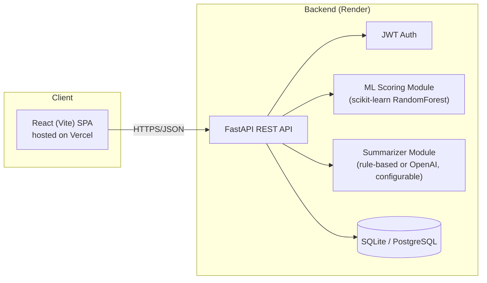

# System Architecture

## Thành phần chính

| Thành phần | Công nghệ | Vai trò |
|---|---|---|
| Frontend | React 18, Vite, Axios, TailwindCSS | Giao diện dashboard, form nhập liệu |
| Backend API | FastAPI, Pydantic, SQLAlchemy | REST API, xác thực, điều phối nghiệp vụ |
| ML Module | scikit-learn (RandomForestClassifier) | Chấm điểm lead + giải thích feature importance |
| Summarizer | sumy (extractive) mặc định, hoặc OpenAI API nếu có key | Tóm tắt ghi chú cuộc gọi |
| Database | SQLite (dev/demo), PostgreSQL (production-ready) | Lưu trữ lead, ghi chú, user |
| Auth | JWT (python-jose + passlib) | Đăng nhập, bảo vệ endpoint |
| CI/CD | GitHub Actions | Chạy test tự động khi push |
| Hosting | Render (backend + DB), Vercel (frontend) | Triển khai online, có domain public |

## Vì sao chọn stack này
- **FastAPI**: hiệu năng cao, tự sinh OpenAPI docs (`/docs`), rất phổ biến trong tuyển dụng AI/Backend Python hiện nay.
- **scikit-learn**: đơn giản, dễ giải thích (interpretable), phù hợp thể hiện hiểu biết ML nền tảng thay vì chỉ gọi API LLM.
- **React + Vite**: build nhanh, hệ sinh thái lớn, dễ tuyển dụng frontend nhận diện.
- **SQLite → PostgreSQL**: bắt đầu đơn giản, nhưng thiết kế theo SQLAlchemy ORM nên chuyển sang Postgres chỉ cần đổi connection string, không đổi code nghiệp vụ.
