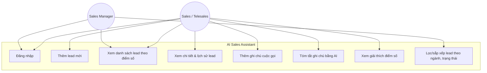
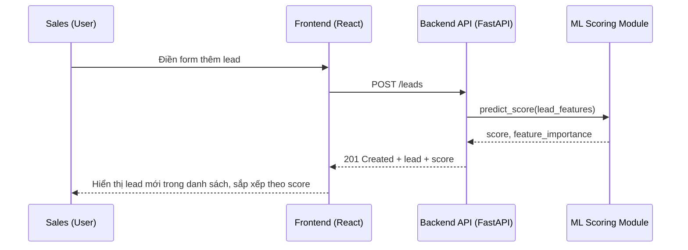

# Use Cases & User Flows

## Use Case Diagram

## Use Case chi tiết: UC-06 Tóm tắt ghi chú bằng AI

**Actor:** Sales / Telesales
**Tiền điều kiện:** Lead đã có ít nhất 1 ghi chú cuộc gọi.
**Luồng chính:**
1. Sales mở trang chi tiết lead.
2. Sales bấm nút "Tóm tắt".
3. Hệ thống gửi toàn bộ ghi chú đến module Summarizer.
4. Summarizer trả về bản tóm tắt (2-3 câu) + đề xuất hành động tiếp theo.
5. Hệ thống hiển thị kết quả và lưu lại để lần sau không cần tính lại (cache).

**Luồng phụ:**
- 3a. Nếu không có `OPENAI_API_KEY`, hệ thống dùng thuật toán extractive summarization nội bộ (rule-based), không có lỗi xảy ra với người dùng.

## User Flow: Thêm lead mới → thấy điểm số

## Wireframe mô tả (xem chi tiết hình trong docs/wireframes.md)
- Trang Dashboard: bảng danh sách lead, cột Score có màu (xanh > 70, vàng 40-70, đỏ < 40), bộ lọc bên trái.
- Trang Lead Detail: thông tin lead, thanh điểm số + top 3 yếu tố ảnh hưởng, khung ghi chú dạng timeline, nút "Tóm tắt bằng AI".
